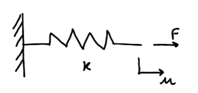
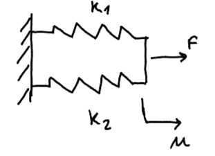
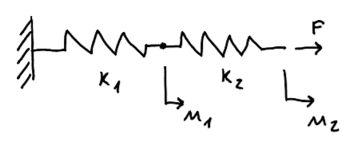
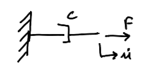
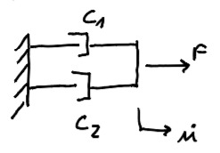
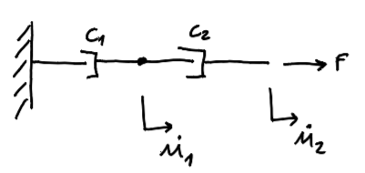
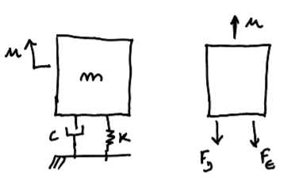
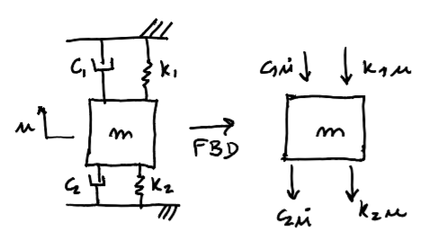
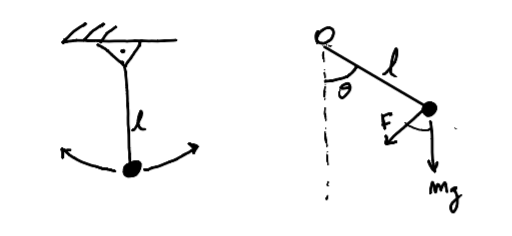

## Introduction

In the previous class we understood the role of **springs** and **dampers** as the fundamental passive elements in a vibrating mechanical system. Now we address two important questions:

1. What is the **equivalent stiffness/damping** when elements are combined?
2. Once we know all the elements, how do we obtain the **equation of motion** that governs the dynamics of the whole system?

---

## Combining Springs

### Single Spring

The constitutive relation of a linear spring is:

$$F = k\, u \quad \Longrightarrow \quad u = \frac{F}{k}$$

where $k$ is the stiffness (N/m), $u$ is the elongation (m), and $F$ is the applied force (N).

{fig-align="center" width="55%"}

### Springs in Parallel

When two springs share the same displacement $u$, the forces add:

$$F = F_1 + F_2 = k_1 u + k_2 u = (k_1+k_2)\,u$$

So the **equivalent stiffness** is:

$$\boxed{k_{\text{eq}} = k_1 + k_2}$$

{fig-align="center" width="50%"}

If we have more than two springs, we have then

$$\boxed{k_1 + k_2 + \cdots + k_n}$$

The equivalent stiffness is simply the **sum** of the individual stiffnesses.

---

### Springs in Series

When two springs are connected end-to-end, the same force $F$ passes through both and the displacements add:

$$u = u_1 + u_2 = \frac{F}{k_1} + \frac{F}{k_2} = F\!\left(\frac{1}{k_1}+\frac{1}{k_2}\right)$$

So the **equivalent stiffness** is:

$$\boxed{\frac{1}{k_{\text{eq}}} = \frac{1}{k_1}+\frac{1}{k_2}}$$

{fig-align="center" width="70%"}

If we have more springs in series, we have then

$$\boxed{\frac{1}{k_{\text{eq}}} = \frac{1}{k_1}+\frac{1}{k_2}+\cdots+\frac{1}{k_n}}$$

in which $n$ represents the number of springs.

## Combining Dampers

### Single Damper

The constitutive relation of a linear (viscous) damper is:

$$F = c\,\dot{u}$$

where $c$ is the damping coefficient (N·s/m) and $\dot{u}$ is the relative velocity.

{fig-align="center" width="45%"}

### Dampers in Parallel

When two dampers share the same velocity $\dot{u}$, the forces add — exactly analogous to springs in parallel:

$$F = c_1\dot{u} + c_2\dot{u} = (c_1+c_2)\,\dot{u}$$

$$\boxed{c_{\text{eq}} = c_1 + c_2}$$

{fig-align="center" width="50%"}

Again, for more dampers the equivalent damping will be

$$c_{eq} = c_1 + c_2 + \cdots + c_n$$

### Dampers in Series

When two dampers are connected in series, the same force acts on both and the velocities add:

$$\dot{u} = \dot{u}_1 + \dot{u}_2 = \frac{F_e}{c_1} + \frac{F_e}{c_2}$$

$$\boxed{\frac{1}{c_{\text{eq}}} = \frac{1}{c_1}+\frac{1}{c_2}}$$

{fig-align="center" width="50%"}

One more time, for more than one damper, we have 

$$\frac{1}{c_{eq}} = \frac{1}{c_1} + \frac{1}{c_2} + \cdots + \frac{1}{c_n}$$

Here, $n$ is the number of dampers.

## Equation of Motion

Now that we understand the basic elements that constitute a simple mechanical system,. Let's understand how to obtain the equation of motion.
Consider a mass $m$ supported by a spring $k$ and a damper $c$ in parallel, subjected to displacement $u$ (positive upward).

{fig-align="center" width="50%"}

The **Free Body Diagram** (FBD) shows two forces acting on the mass, both opposing the positive $u$ direction:

- Spring force: $F_s = - ku$ (downward)
- Damping force: $F_e = - c\dot{u}$ (downward)

Applying Newton's second law ($\sum F = m\ddot{u}$) in the positive direction:

$$m\ddot{u} = -ku - c\dot{u}$$

Rearranging:

::: {.callout-important}
## Equation of Motion — 1-DOF System

$$\boxed{m\ddot{u} + c\dot{u} + ku = 0}$$

| Term | Name |
|------|------|
| $m\ddot{u}$ | Inertia force |
| $c\dot{u}$ | Damping force |
| $ku$ | Elastic (spring) force |

Any external excitation adds a right-hand side: $m\ddot{u} + c\dot{u} + ku = F(t)$ because of the balance of forces.
:::

---

## Exercises

### Exercise 1 — System with Two Spring-Damper Pairs in Parallel

Find the equation of motion of the system below, where two spring-damper pairs $(c_1,k_1)$ and $(c_2,k_2)$ are arranged in parallel between the ground and the mass $m$.

{fig-align="center" width="70%"}

**Solution.** The FBD gives four forces acting downward on the mass:
$c_1\dot{u}$, $k_1 u$, $c_2\dot{u}$, and $k_2 u$. Applying Newton's second law:

$$m\ddot{u} = -c_1\dot{u} - k_1 u - c_2\dot{u} - k_2 u$$

Rearranging:

$$\boxed{m\ddot{u} + \underbrace{(c_1+c_2)}_{c_{\text{eq}}}\dot{u} + \underbrace{(k_1+k_2)}_{k_{\text{eq}}}u = 0}$$

> **Note:** The equivalent stiffness and damping are both sums — confirming the parallel combination rules.

---

### Exercise 2 — The Simple Pendulum

Find the equation of motion of a simple pendulum of length $l$ and mass $m$.

{fig-align="center" width="55%"}

**Key insight:** only one coordinate — the angle $\theta$ — is needed to describe the entire configuration. This is a **1-DOF system**.

For a rotating body, Newton's second law becomes the **moment equation** about the pivot $O$:

$$\sum M_O = J_O\,\ddot\theta$$

The only moment is due to gravity. The tangential component of gravity is $mg\sin\theta$, acting at distance $l$:

$$-mgl\sin\theta = J_O\,\ddot\theta$$

The moment of inertia of a point mass about $O$ is $J_O = ml^2$, so:

$$ml^2\ddot\theta = -mgl\sin\theta$$

Dividing by $ml^2$ and applying the **small-angle approximation** ($\sin\theta \approx \theta$ for $\theta \approx 0$):

$$\boxed{\ddot\theta + \frac{g}{l}\,\theta = 0}$$

This has exactly the same structure as $m\ddot{u} + ku = 0$, with the identification $k/m \leftrightarrow g/l$.

---

## Free Vibration Response

We now solve the undamped free equation of motion:

$$m\ddot{u} + ku = 0$$

### Proposed Solution

By intuition, we expect the system to oscillate. We propose:

$$u(t) = A\sin(\omega_n t + \phi)$$

Computing the derivatives:

$$\dot{u}(t) = A\omega_n\cos(\omega_n t + \phi), \qquad \ddot{u}(t) = -A\omega_n^2\sin(\omega_n t+\phi)$$

Substituting into the equation of motion:

$$-m\omega_n^2 A\sin(\omega_n t+\phi) + kA\sin(\omega_n t+\phi) = 0$$

$$A\sin(\omega_n t+\phi)\bigl(k - m\omega_n^2\bigr) = 0$$

This must hold for all $t$, so:

$$k - m\omega_n^2 = 0 \quad \Rightarrow \quad \omega_n^2 = \frac{k}{m}$$

::: {.callout-important}
## Natural Frequency

$$\boxed{\omega_n = \sqrt{\frac{k}{m}}} \quad \text{[rad/s]}$$

The natural frequency tells us how quickly the system exchanges kinetic and potential energy. A stiffer or lighter system vibrates faster.
:::

The **period** of oscillation and the **frequency in Hz** are:

$$T_n = \frac{2\pi}{\omega_n}, \qquad f_n = \frac{\omega_n}{2\pi}$$

### Determining $A$ and $\phi$ from Initial Conditions

The constants $A$ (amplitude) and $\phi$ (phase angle) are fixed by the **initial conditions** $u(0) = u_0$ and $\dot{u}(0) = v_0$:

$$u(0) = A\sin(\phi) = u_0$$
$$\dot{u}(0) = A\omega_n\cos(\phi) = v_0$$

Dividing:

$$\tan\phi = \frac{u_0\omega_n}{v_0} \quad \Rightarrow \quad \phi = \arctan\!\left(\frac{u_0\,\omega_n}{v_0}\right)$$

And the amplitude:

$$A = \sqrt{u_0^2 + \left(\frac{v_0}{\omega_n}\right)^2}$$

The complete solution is:

$$\boxed{u(t) = \sqrt{u_0^2 + \left(\frac{v_0}{\omega_n}\right)^2}\;\sin\!\left(\omega_n t + \arctan\!\frac{u_0\,\omega_n}{v_0}\right)}$$

---

## 🎛️ Interactive: Free Vibration Explorer

Use the sliders below to explore how mass $m$, stiffness $k$, and initial conditions affect the free vibration response $u(t) = A\sin(\omega_n t + \phi)$.

```{ojs}
//| panel: input
viewof m_val  = Inputs.range([0.1, 10],  {value: 1.0, step: 0.1, label: "Mass  m  (kg)"})
viewof k_val  = Inputs.range([1, 200],   {value: 20,  step: 1,   label: "Stiffness  k  (N/m)"})
viewof u0_val = Inputs.range([-3, 3],    {value: 1.0, step: 0.1, label: "Initial displacement  u₀  (m)"})
viewof v0_val = Inputs.range([-10, 10],  {value: 0.0, step: 0.5, label: "Initial velocity  v₀  (m/s)"})
```

```{ojs}
wn     = Math.sqrt(k_val / m_val)
Tn     = 2 * Math.PI / wn
fn     = wn / (2 * Math.PI)
phi_ic = Math.atan2(u0_val * wn, v0_val)
A_amp  = Math.sqrt(u0_val**2 + (v0_val / wn)**2)

// Fixed 30 s time window — curve changes shape, axis stays constant
data_free = Array.from({length: 901}, (_, i) => ({
  t: i * 30 / 900,
  u: A_amp * Math.sin(wn * i * 30 / 900 + phi_ic)
}))
```

```{ojs}
html`
<div style="display:flex;gap:2rem;flex-wrap:wrap;margin:0.5rem 0 1rem 0;font-size:0.93em;color:#333;background:#f8f9fa;padding:0.6rem 1.1rem;border-radius:6px">
  <span>𝜔ₙ = <strong>${wn.toFixed(3)} rad/s</strong></span>
  <span>fₙ = <strong>${fn.toFixed(3)} Hz</strong></span>
  <span>Tₙ = <strong>${Tn.toFixed(3)} s</strong></span>
  <span>A = <strong>${A_amp.toFixed(3)} m</strong></span>
  <span>𝜙 = <strong>${(phi_ic * 180 / Math.PI).toFixed(1)}°</strong></span>
</div>`
```

```{ojs}
Plot.plot({
  marks: [
    Plot.ruleY([0], {stroke: "#ccc"}),
    Plot.line(data_free, {
      x: "t", y: "u",
      stroke: "#1a6faf", strokeWidth: 2.5
    }),
    Plot.dot([{t: 0, u: u0_val}], {x: "t", y: "u", fill: "#c0392b", r: 6})
  ],
  x: {label: "Time  t  (s)", domain: [0, 30], grid: true},
  y: {label: "Displacement  u(t)  (m)", grid: true},
  width: 700, height: 320,
  style: {fontSize: "13px"}
})
```

> **Try this:** Set $v_0 = 0$ and vary $u_0$ — you get a pure sine with amplitude $A = u_0$. Set $u_0 = 0$ and vary $v_0$ — you get a sine shifted by 90°. Increase $k$ or decrease $m$ to raise $\omega_n$ and see more oscillations within the 30 s windo


---

## What Comes Next

In this class we derived the equation of motion and studied the **free, undamped** response: the system oscillates indefinitely at $\omega_n$ with no energy loss.

In reality, structures are driven by external forces. In Class 3 we add a **harmonic excitation** to the right-hand side:

$$m\ddot{u} + ku = F_0\sin(\omega t)$$

This will reveal the phenomenon of **resonance** — what happens when the excitation frequency $\omega$ approaches the natural frequency $\omega_n$.
