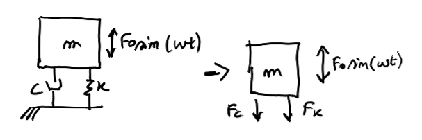
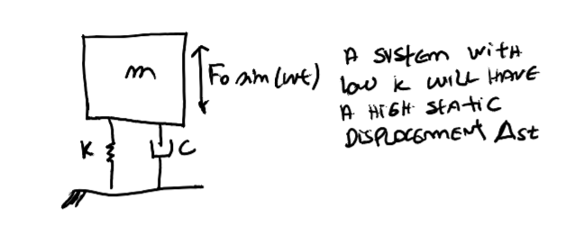
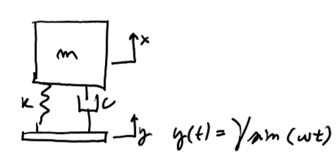

## 6.1 Introduction

Imagine a mass $m$ sitting on a spring $k$ and a damper $c$, driven by a harmonic force $F_0\sin(\omega t)$. We already know from Class 4 how the mass moves. Now we ask the next engineering question:

> **What forces $F_k$ and $F_c$ are transmitted to the ground?**

The spring and damper are the only mechanical links between mass and ground — all force reaching the support must pass through them. This is the problem of **transmissibility**.

**General definition of transmissibility $T$:**

$$T = \frac{\text{transmitted output}}{\text{input excitation}}$$

Two physically distinct cases arise:

**Case 1 — Force transmissibility:** A machine vibrates and transmits force to the ground.

$$T_F = \frac{F_{t,0}}{F_0} = \frac{\text{output force amplitude}}{\text{input force amplitude}}$$

**Case 2 — Motion transmissibility:** The base/ground oscillates and transmits its movement to the mass.

$$T_R = \frac{x}{y} = \frac{\text{oscillation of the mass}}{\text{oscillation of the base}}$$

---

## 6.2 Force Transmissibility

### Physical Setup

A machine (mass $m$) sits on a spring–damper isolation mount and is driven by a harmonic force $F_0\sin(\omega t)$. The spring and damper are the only mechanical connections to the ground — all force reaching the support must pass through them.

{fig-align="center" width="75%"}

*Left: machine on spring–damper mount driven by $F_0\sin(\omega t)$. Right: the spring and damper are the only force paths to ground, transmitting $F_k = ku$ and $F_c = c\dot{u}$.*

### Transmitted Force Amplitude

The total instantaneous force at the support is the sum of the spring and damper reactions:

$$F_t(t) = k\,u(t) + c\,\dot{u}(t)$$

With the steady-state solution $u(t) = U\sin(\omega t - \phi)$ and $\dot{u}(t) = U\omega\cos(\omega t - \phi)$:

$$k\,u(t) = kU\sin(\omega t - \phi) \qquad \text{(elastic — in phase with }u\text{)}$$

$$c\,\dot{u}(t) = c\omega U\cos(\omega t - \phi) \qquad \text{(damping — 90° ahead of }u\text{)}$$

Since these two components are **90° out of phase**, their amplitudes combine quadratically:

$$F_{t,0} = \sqrt{(kU)^2 + (c\omega U)^2} = U\sqrt{k^2 + (c\omega)^2}$$

### Deriving the Transmissibility Formula

Substituting $U = F_0/\sqrt{(k-m\omega^2)^2+(c\omega)^2}$:

$$T_F = \frac{F_{t,0}}{F_0} = \frac{U\sqrt{k^2+(c\omega)^2}}{F_0} = \frac{\sqrt{k^2+(c\omega)^2}}{\sqrt{(k-m\omega^2)^2+(c\omega)^2}}$$

Dividing numerator and denominator by $k$, and using $r = \omega/\omega_n$, $\zeta = c/(2m\omega_n)$:

::: {.callout-important}
## Force Transmissibility

$$\boxed{T_F = \frac{\sqrt{1+(2\zeta r)^2}}{\sqrt{(1-r^2)^2+(2\zeta r)^2}}}$$

This dimensionless function depends only on $r$ (the frequency ratio) and $\zeta$ (the damping ratio). It is plotted below and reveals three distinct operating regimes.
:::

---

## 6.3 Interpreting the Transmissibility Curve

### The Three Regimes

<figure style="text-align:center;margin:1.5rem auto">
<svg viewBox="0 0 560 265" width="620" xmlns="http://www.w3.org/2000/svg" style="max-width:100%">
  <!-- Uniform scale: x = 45 + r*142.857 (r=0→45, r=1→188, r=√2→247, r=2→331, r=3→474, r=3.5→545) -->
  <!-- T scale: y = 240 − T*36.667 (T=0→240, T=1→203, T=6→20) -->
  <!-- Background regions -->
  <rect x="45" y="25" width="202" height="215" fill="#fdecea" rx="2"/>
  <rect x="247" y="25" width="298" height="215" fill="#eafaf1" rx="2"/>
  <!-- Region labels -->
  <text x="146" y="50" text-anchor="middle" font-size="11" fill="#c0392b" font-weight="bold">Amplification</text>
  <text x="146" y="63" text-anchor="middle" font-size="11" fill="#c0392b">T &gt; 1</text>
  <text x="396" y="50" text-anchor="middle" font-size="11" fill="#27ae60" font-weight="bold">Isolation</text>
  <text x="396" y="63" text-anchor="middle" font-size="11" fill="#27ae60">T &lt; 1</text>
  <!-- Axes -->
  <line x1="45" y1="240" x2="550" y2="240" stroke="#333" stroke-width="1.8" marker-end="url(#ax6s)"/>
  <line x1="45" y1="240" x2="45" y2="18" stroke="#333" stroke-width="1.8" marker-end="url(#ax6s)"/>
  <text x="555" y="245" font-size="12" fill="#333" font-style="italic">r</text>
  <text x="50" y="16" font-size="12" fill="#333" font-style="italic">T</text>
  <!-- T = 1 horizontal dashed line -->
  <line x1="45" y1="203" x2="545" y2="203" stroke="#888" stroke-width="1.2" stroke-dasharray="5,4"/>
  <text x="35" y="207" font-size="11" fill="#888" text-anchor="end">1</text>
  <!-- sqrt(2) vertical dashed line at x = 247 -->
  <line x1="247" y1="25" x2="247" y2="240" stroke="#555" stroke-width="1.5" stroke-dasharray="6,4"/>
  <text x="247" y="256" text-anchor="middle" font-size="11" fill="#555">√2</text>
  <!-- Axis ticks at r = 0, 1, 2, 3 -->
  <line x1="45"  y1="238" x2="45"  y2="242" stroke="#555" stroke-width="1.2"/>
  <text x="45"  y="254" text-anchor="middle" font-size="11" fill="#555">0</text>
  <line x1="188" y1="238" x2="188" y2="242" stroke="#555" stroke-width="1.2"/>
  <text x="188" y="254" text-anchor="middle" font-size="11" fill="#555">1</text>
  <line x1="331" y1="238" x2="331" y2="242" stroke="#555" stroke-width="1.2"/>
  <text x="331" y="254" text-anchor="middle" font-size="11" fill="#555">2</text>
  <line x1="474" y1="238" x2="474" y2="242" stroke="#555" stroke-width="1.2"/>
  <text x="474" y="254" text-anchor="middle" font-size="11" fill="#555">3</text>
  <!-- Transmissibility curve, ζ = 0.15, Python-computed polyline -->
  <!-- TF = sqrt(1+(2ζr)²) / sqrt((1-r²)²+(2ζr)²); scale x=45+r*142.857, y=240-TF*36.667 -->
  <!-- T_F > 1 for 0 < r < √2; T_F = 1 at r = √2; T_F < 1 for r > √2 (all ζ) -->
  <polyline points="45.1,203.3 48.0,203.3 50.9,203.3 53.7,203.2 56.6,203.1 59.4,203.0 62.3,202.8 65.1,202.6 68.0,202.4 70.9,202.1 73.7,201.8 76.6,201.5 79.4,201.1 82.3,200.7 85.1,200.2 88.0,199.7 90.9,199.2 93.7,198.6 96.6,197.9 99.4,197.2 102.3,196.4 105.1,195.6 108.0,194.7 110.9,193.7 113.7,192.6 116.6,191.5 119.4,190.2 122.3,188.8 125.1,187.3 128.0,185.7 130.9,183.9 133.7,181.9 136.6,179.7 139.4,177.4 142.3,174.8 145.1,171.9 148.0,168.8 150.9,165.3 153.7,161.5 156.6,157.2 159.4,152.6 162.3,147.6 165.1,142.1 168.0,136.4 170.9,130.5 173.7,124.7 176.6,119.3 179.4,114.9 182.3,112.1 185.1,111.2 188.0,112.5 190.9,116.0 193.7,121.2 196.6,127.6 199.4,134.5 202.3,141.6 205.1,148.6 208.0,155.1 210.9,161.1 213.7,166.7 216.6,171.7 219.4,176.2 222.3,180.4 225.1,184.1 228.0,187.4 230.9,190.5 233.7,193.3 236.6,195.8 239.4,198.1 242.3,200.2 245.1,202.1 248.0,203.9 250.9,205.6 253.7,207.1 256.6,208.5 259.4,209.8 262.3,211.0 265.1,212.1 268.0,213.2 270.9,214.2 273.7,215.1 276.6,216.0 279.4,216.8 282.3,217.6 285.1,218.3 288.0,219.0 290.9,219.7 293.7,220.3 296.6,220.9 299.4,221.4 302.3,221.9 305.1,222.4 308.0,222.9 310.9,223.4 313.7,223.8 316.6,224.2 319.4,224.6 322.3,225.0 325.1,225.4 328.0,225.7 330.9,226.0 333.7,226.4 336.6,226.7 339.4,227.0 342.3,227.2 345.1,227.5 348.0,227.8 350.9,228.0 353.7,228.3 356.6,228.5 359.4,228.7 362.3,229.0 365.1,229.2 368.0,229.4 370.9,229.6 373.7,229.8 376.6,229.9 379.4,230.1 382.3,230.3 385.1,230.5 388.0,230.6 390.9,230.8 393.7,230.9 396.6,231.1 399.4,231.2 402.3,231.4 405.1,231.5 408.0,231.6 410.9,231.8 413.7,231.9 416.6,232.0 419.4,232.1 422.3,232.2 425.1,232.4 428.0,232.5 430.9,232.6 433.7,232.7 436.6,232.8 439.4,232.9 442.3,233.0 445.1,233.1 448.0,233.1 450.9,233.2 453.7,233.3 456.6,233.4 459.4,233.5 462.3,233.6 465.1,233.6 468.0,233.7 470.9,233.8 473.7,233.9 476.6,233.9 479.4,234.0 482.3,234.1 485.1,234.2 488.0,234.2 490.9,234.3 493.7,234.3 496.6,234.4 499.4,234.5 502.3,234.5 505.1,234.6 508.0,234.6 510.9,234.7 513.7,234.8 516.6,234.8 519.4,234.9 522.3,234.9 525.1,235.0 528.0,235.0 530.9,235.1 533.7,235.1 536.6,235.2 539.4,235.2 542.3,235.3 545.1,235.3"
           fill="none" stroke="#1a4a7a" stroke-width="2.8" stroke-linejoin="round"/>
  <!-- Peak at r≈0.978, TF≈3.513 → (185, 111) -->
  <circle cx="185" cy="111" r="5" fill="#c0392b"/>
  <text x="195" y="108" font-size="11" fill="#c0392b">Peak (r ≈ 1)</text>
  <!-- Isolation threshold marker at r=√2, T=1 -->
  <circle cx="247" cy="203" r="5" fill="#555"/>
  <text x="252" y="219" font-size="10" fill="#555">T = 1 for all ζ</text>
  <!-- Axis arrow defs -->
  <defs>
    <marker id="ax6s" markerWidth="7" markerHeight="7" refX="5" refY="3" orient="auto">
      <path d="M0,0 L0,6 L7,3 z" fill="#333"/>
    </marker>
  </defs>
</svg>
<figcaption>Transmissibility $T_F$ versus frequency ratio $r$. All curves (regardless of $\zeta$) pass through $T = 1$ exactly at $r = \sqrt{2}$, dividing the plot into an amplification zone and an isolation zone.</figcaption>
</figure>

### Regime-by-Regime Analysis

**Low frequencies ($r \ll 1$) — No isolation**

$$T \approx 1$$

The excitation is "slow" relative to the system. The mount deforms quasi-statically and transmits nearly all the force. No vibration isolation occurs.

**Near resonance ($r \approx 1$) — Amplification**

$$T > 1 \quad \text{(much greater than 1 for small }\zeta\text{)}$$

This is the **worst operating region**. The system magnifies the input — more force reaches the ground than was applied. Damping is essential here: increasing $\zeta$ dramatically reduces the resonant peak.

**High frequencies ($r > \sqrt{2}$) — Isolation**

$$T < 1 \quad \text{(approaches 0 as }r \to \infty\text{)}$$

Real isolation begins. The isolator attenuates the transmitted force. To achieve isolation, the system must be designed so that $\omega/\omega_n > \sqrt{2}$, i.e., $\omega_n < \omega/\sqrt{2}$.

::: {.callout-warning}
## The Isolation Threshold and the Damping Dilemma

All transmissibility curves — regardless of $\zeta$ — cross $T = 1$ at **exactly** $r = \sqrt{2}$. This is not a coincidence: setting $T_F = 1$ and solving for $r$ yields $r = \sqrt{2}$ for any $\zeta$.

**Key trade-off:** Damping helps near resonance ($\zeta \uparrow \Rightarrow T_\text{max} \downarrow$), but **hurts in the isolation zone** ($r > \sqrt{2}$): higher $\zeta$ raises $T$ above its undamped value. This is because at high frequencies the damper force $c\dot{u} \sim c\omega U$ grows with frequency and increasingly dominates the ground reaction.

The ideal isolator has **low stiffness** (low $\omega_n$, large $r$) and **low damping** — but must survive the startup transient through resonance.
:::

### Static Deflection Trade-off

To lower $\omega_n$ (push the isolation zone to lower frequencies), we need softer springs: $k \downarrow \Rightarrow \omega_n = \sqrt{k/m} \downarrow$. However, a softer spring causes larger static deflection under the weight of the machine:

$$\Delta_{st} = \frac{mg}{k}$$

{fig-align="center" width="65%"}

*A system with low $k$ isolates better at high frequencies but suffers from a large static displacement $\Delta_{st}$.*

A system with lower $k$ isolates better at high frequencies but sags more under its own weight. This is a fundamental engineering constraint — softer isolators require more travel clearance (e.g., air springs in precision instruments, soft suspension in vehicles).

### Does Damping Always Help?

Now we come to an important question: **does damping always help?**

**Answer:**

- Close to resonance ($r \approx 1$) it definitely helps: $\zeta \uparrow \Rightarrow T_\text{max} \downarrow$.

- But at high frequencies ($r \gg 1$) it can make things **much worse**. The total transmitted force is:

$$F_t(t) = k\,u(t) + c\,\dot{u}(t)$$

and since $\dot{u} \sim \omega U$, the damping force grows with frequency. **The higher the frequency, the higher the damping contribution to the transmitted force.** Adding more damping at high $r$ increases $T_F$ rather than reducing it.

This is the fundamental trade-off of passive vibration isolation: the same damping that saves you at resonance hurts you in the isolation zone.

---

## 6.4 Motion Transmissibility — Base Excitation

### Physical Setup

In many applications the **ground itself vibrates**: an earthquake shakes a building's foundation, or road irregularities excite a vehicle. The problem is inverted — the input is a prescribed base motion $y(t) = Y\sin(\omega t)$, and we ask how much motion reaches the mass.

{fig-align="center" width="65%"}

*Base excitation: the platform oscillates as $y(t) = Y\sin(\omega t)$, driving the mass through the spring–damper mount. $x(t)$ is the absolute displacement of the mass; $u = x - y$ is the relative displacement.*

### Equation of Motion

The spring and damper forces depend on the **relative deformation** between mass and base:

$$F_k = k(x - y) = ku, \qquad F_c = c(\dot{x} - \dot{y}) = c\dot{u}$$

Applying Newton's second law to the mass:

$$m\ddot{x} + c(\dot{x}-\dot{y}) + k(x-y) = 0 \quad \Longrightarrow \quad m\ddot{x} + c\dot{x} + kx = c\dot{y} + ky$$

### Relative Displacement $u = x - y$

Substituting $x = u + y$ and $\ddot{x} = \ddot{u} + \ddot{y}$:

$$m(\ddot{u}+\ddot{y}) + c\dot{u} + ku = 0 \quad \Longrightarrow \quad m\ddot{u} + c\dot{u} + ku = -m\ddot{y}$$

With $y(t) = Ye^{i\omega t}$, we have $\ddot{y} = -\omega^2 Ye^{i\omega t}$, so the right-hand side $-m\ddot{y} = m\omega^2 Ye^{i\omega t}$ acts like a **harmonic inertial force** of amplitude $m\omega^2 Y$. Using complex notation:

$$\bigl(k - m\omega^2 + ic\omega\bigr)U = m\omega^2 Y \quad \Longrightarrow \quad \frac{U}{Y} = \frac{m\omega^2}{k-m\omega^2+ic\omega}$$

Taking the modulus:

::: {.callout-important}
## Relative Displacement Transmissibility

$$\boxed{\frac{U}{Y} = \frac{r^2}{\sqrt{(1-r^2)^2+(2\zeta r)^2}}}$$

This gives the amplitude of the mount's deformation relative to the base oscillation amplitude $Y$. It equals zero at $r = 0$ (rigid-body motion) and approaches 1 as $r \to \infty$.
:::

---

## 6.5 Absolute Displacement Transmissibility

For the absolute displacement $x(t)$, we return to the equation $m\ddot{x} + c\dot{x} + kx = c\dot{y} + ky$.

With $y(t) = Ye^{i\omega t}$ and $x(t) = Xe^{i\omega t}$:

$$(-m\omega^2 + ic\omega + k)\,X = (k + ic\omega)\,Y \quad \Longrightarrow \quad \frac{X}{Y} = \frac{k + ic\omega}{k - m\omega^2 + ic\omega}$$

Taking the modulus:

$$T_x = \frac{X}{Y} = \frac{\sqrt{k^2+(c\omega)^2}}{\sqrt{(k-m\omega^2)^2+(c\omega)^2}}$$

::: {.callout-important}
## Absolute Motion Transmissibility = Force Transmissibility

$$\boxed{T_x = \frac{X}{Y} = \frac{\sqrt{1+(2\zeta r)^2}}{\sqrt{(1-r^2)^2+(2\zeta r)^2}} = T_F}$$

The formula is **identical** to the force transmissibility. This elegant result means the same plot and the same design rules apply to both problems: a machine on isolators and a structure on a shaking foundation.
:::

---

## 6.6 Summary — Three Frequency Regimes

| Regime | Condition | Absolute $X/Y$ | Relative $U/Y$ | Physical meaning |
|--------|-----------|----------------|-----------------|-----------------|
| **Low frequency** | $r \ll 1$ | $\approx 1$ | $\approx 0$ | Mass moves with base; mount barely deforms |
| **Resonance** | $r \approx 1$ | $\gg 1$ | $\gg 1$ | Both amplified; worst region |
| **High frequency** | $r \gg 1$ | $\approx 0$ | $\approx 1$ | Mass stays still; mount carries all deformation |

In the high-frequency regime, the mass is essentially **stationary in space** while the base oscillates beneath it — the ideal seismic isolation condition. The mount must accommodate the full relative displacement $u \approx y$.

---

## 🎛️ Interactive: Transmissibility Explorer

Explore how the damping ratio $\zeta$ and frequency ratio $r$ shape both the force transmissibility $T_F$ (= absolute motion transmissibility $X/Y$) and the relative displacement ratio $U/Y$. The dashed vertical line marks the isolation threshold $r = \sqrt{2}$.

```{ojs}
//| panel: input
viewof zeta6    = Inputs.range([0.01, 1.5],  {value: 0.15, step: 0.01,  label: "Damping ratio  ζ"})
viewof show_multi6   = Inputs.toggle({label: "Show multiple ζ curves", value: false})
viewof show_rel6     = Inputs.toggle({label: "Show relative displacement  U/Y", value: true})
viewof r_op6    = Inputs.range([0.01, 3.5],  {value: 0.7,  step: 0.01,  label: "Operating point  r = ω/ωₙ"})
```

```{ojs}
// Transmissibility functions
function TF6(r, zeta) {
  return Math.sqrt(1 + (2*zeta*r)**2) / Math.sqrt((1-r**2)**2 + (2*zeta*r)**2)
}
function relDisp6(r, zeta) {
  return r**2 / Math.sqrt((1-r**2)**2 + (2*zeta*r)**2)
}

r6_pts = Array.from({length: 900}, (_, i) => {
  let r = 0.01 + i * (3.49 / 899)
  return r
})

// Single-curve data
data6_TF  = r6_pts.map(r => ({r, y: Math.min(TF6(r, zeta6), 14)}))
data6_rel = r6_pts.map(r => ({r, y: Math.min(relDisp6(r, zeta6), 14)}))

// Multi-curve data
zeta6_list   = [0.05, 0.1, 0.2, 0.3, 0.5, 0.7, 1.0]
colors6_zeta = ["#c0392b","#e67e22","#f1c40f","#27ae60","#1a6faf","#8e44ad","#555"]
data6_multi_TF = zeta6_list.flatMap((z, i) =>
  r6_pts.map(r => ({r, y: Math.min(TF6(r, z), 14), zeta: z, color: colors6_zeta[i]}))
)
data6_multi_rel = zeta6_list.flatMap((z, i) =>
  r6_pts.map(r => ({r, y: Math.min(relDisp6(r, z), 14), zeta: z, color: colors6_zeta[i]}))
)

// Operating point values
TF_op6  = TF6(r_op6, zeta6)
rel_op6 = relDisp6(r_op6, zeta6)
regime6 = r_op6 < 0.8 ? "Low frequency (T ≈ 1, no isolation)"
        : r_op6 < 1.2 ? "Near resonance (T > 1 — amplification)"
        : r_op6 < Math.sqrt(2) ? "Transition (T > 1)"
        : "Isolation zone (T < 1) ✓"
```

```{ojs}
html`
<div style="display:flex;gap:1.4rem;flex-wrap:wrap;margin:0.4rem 0 1rem 0;font-size:0.93em;background:#f8f9fa;padding:0.65rem 1.1rem;border-radius:6px">
  <span>r = <strong>${r_op6.toFixed(2)}</strong></span>
  <span>ζ = <strong>${zeta6.toFixed(2)}</strong></span>
  <span>T_F = X/Y = <strong style="color:${TF_op6 > 1 ? '#c0392b' : '#27ae60'}">${TF_op6 > 13 ? '→ ∞' : TF_op6.toFixed(3)}</strong></span>
  ${show_rel6 ? html`<span>U/Y = <strong style="color:#e67e22">${rel_op6.toFixed(3)}</strong></span>` : html``}
  <span>Regime: <strong style="color:${r_op6 > Math.sqrt(2) ? '#27ae60' : '#c0392b'}">${regime6}</strong></span>
</div>`
```

```{ojs}
Plot.plot({
  title: "Transmissibility  T_F = X/Y  (Force & Absolute Motion)",
  marks: [
    // Isolation zone shading
    Plot.rect([{}], {x1: Math.sqrt(2), x2: 3.5, y1: 0, y2: 10,
      fill: "#eafaf1", fillOpacity: 0.6}),
    // Reference lines
    Plot.ruleY([1], {stroke: "#aaa", strokeDasharray: "5,4"}),
    Plot.ruleX([Math.sqrt(2)], {stroke: "#555", strokeDasharray: "6,4", strokeWidth: 1.8}),
    Plot.ruleY([0], {stroke: "#eee"}),
    // Multi-curves (optional)
    ...(show_multi6
      ? zeta6_list.map((z, i) =>
          Plot.line(data6_multi_TF.filter(d => d.zeta === z), {
            x: "r", y: "y", stroke: colors6_zeta[i], strokeWidth: 1.5,
            strokeOpacity: z === zeta6 ? 1.0 : 0.4
          })
        )
      : []),
    // Main TF curve
    Plot.line(show_multi6 ? data6_multi_TF.filter(d => d.zeta === zeta6) : data6_TF, {
      x: "r", y: "y", stroke: "#1a4a7a", strokeWidth: show_multi6 ? 3.0 : 2.8
    }),
    // Relative displacement U/Y (optional overlay)
    ...(show_rel6 ? [
      Plot.line(show_multi6 ? data6_multi_rel.filter(d => d.zeta === zeta6) : data6_rel, {
        x: "r", y: "y", stroke: "#e67e22", strokeWidth: 2.2, strokeDasharray: "7,4"
      })
    ] : []),
    // Operating point dots
    Plot.dot([{r: r_op6, y: Math.min(TF_op6, 9.9)}], {x: "r", y: "y", fill: "#1a4a7a", r: 6}),
    ...(show_rel6 ? [Plot.dot([{r: r_op6, y: Math.min(rel_op6, 9.9)}], {x: "r", y: "y", fill: "#e67e22", r: 6})] : []),
    // sqrt(2) label
    Plot.text([{r: Math.sqrt(2)+0.05, y: 9.2}], {x: "r", y: "y", text: d => "r = √2", fontSize: 11, fill: "#555"})
  ],
  x: {label: "Frequency ratio  r = ω/ωₙ", domain: [0, 3.5], grid: true},
  y: {label: "Transmissibility", domain: [0, 10], grid: true},
  width: 720, height: 320,
  style: {fontSize: "13px"}
})
```

```{ojs}
show_multi6 ? html`
<div style="display:flex;gap:1.1rem;flex-wrap:wrap;font-size:0.82em;margin-top:0.3rem">
  ${zeta6_list.map((z,i) => html`<span><span style="color:${colors6_zeta[i]};font-weight:bold">—</span> ζ = ${z}</span>`)}
</div>` : html``
```

```{ojs}
show_rel6 ? html`
<div style="font-size:0.85em;color:#666;margin-top:0.3rem">
  <span style="color:#1a4a7a;font-weight:bold">——</span>&nbsp; Force/absolute transmissibility T_F = X/Y &emsp;
  <span style="color:#e67e22">— — —</span>&nbsp; Relative displacement U/Y
</div>` : html``
```

> **Key observations:**
>
> - **All curves cross $T = 1$ at $r = \sqrt{2}$**, regardless of $\zeta$. Below this threshold, the mount amplifies; above it, the mount isolates.
> - **Near resonance:** Increasing $\zeta$ strongly reduces the peak — damping is beneficial here.
> - **Above $r = \sqrt{2}$:** Increasing $\zeta$ *raises* the transmissibility — damping degrades isolation at high frequencies. The trade-off is unavoidable with passive linear isolators.
> - **Relative displacement $U/Y$:** starts near 0 at low $r$ and approaches 1 at high $r$. In the isolation regime, the mount deformation is nearly equal to the base amplitude — the mount must accommodate this travel.

---

## What Comes Next

With the 1-DOF system fully understood, we now generalise to systems with **two degrees of freedom**. Instead of a single mass, we have two masses connected by springs — and this changes everything.

Class 7 introduces the **2DOF free vibration** problem:

$$\mathbf{M}\ddot{\mathbf{u}} + \mathbf{K}\mathbf{u} = \mathbf{0}$$

We will find that a 2DOF system has **two natural frequencies** and **two mode shapes**, and that the eigenvalue problem is the key tool to extract them.
