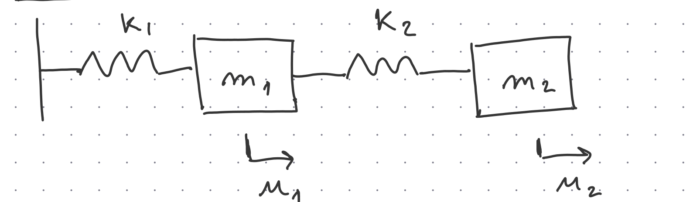
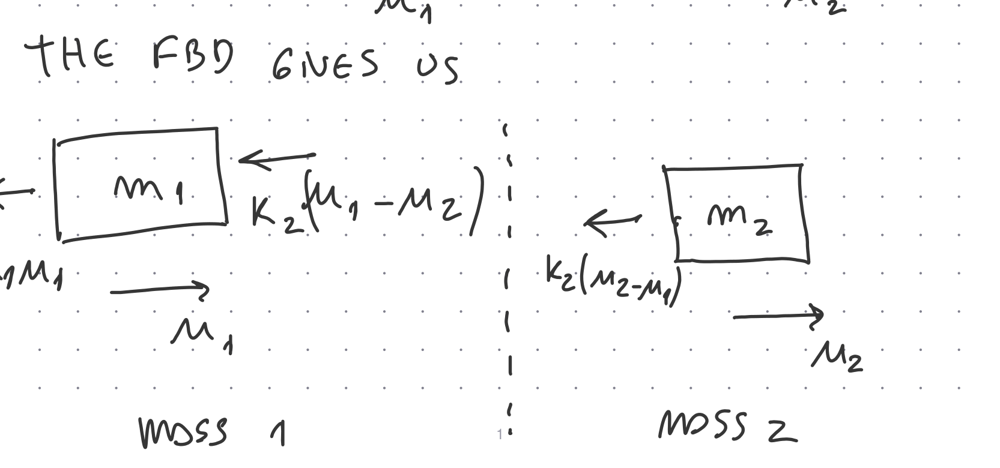

## 7.1 From SDOF to 2DOF

In our last class, we analyzed the **transfer of forces to the base** of a 1DOF system. Now, imagine that instead of a base or ground, we have **another mass**. Let us see how this works by studying a unit mass connected to another mass.

The system we will analyze is:

{fig-align="center" width="75%"}

Displacements $u_1(t)$ and $u_2(t)$ are measured positive to the right from the equilibrium position of each mass.

::: {.callout-note}
## Coordinates
We need **two** independent coordinates $u_1(t)$ and $u_2(t)$ — one per mass. Each coordinate is measured from the static equilibrium position of that mass. This is the key difference from the SDOF case: one equation of motion is no longer enough.
:::

The spring $k_2$ **couples** the two masses. The motion of $m_1$ affects $m_2$, and vice versa. If $k_2 = 0$, the two masses would be independent 1DOF oscillators.

---

## 7.2 Free-Body Diagrams

We take positive displacement to the right.

{fig-align="center" width="80%"}

### Mass 1

Spring $k_1$ is attached to the wall. Its deformation is $u_1$, so the force on $m_1$ is $-k_1 u_1$.

Spring $k_2$ connects both masses. Its deformation is $u_2 - u_1$, so the force on $m_1$ is $k_2(u_2 - u_1)$.

Applying Newton's second law:

$$m_1\ddot{u}_1 = -k_1 u_1 + k_2(u_2 - u_1)$$

Rearranging:

$$\boxed{m_1\ddot{u}_1 + (k_1+k_2)u_1 - k_2 u_2 = 0}$$

### Mass 2

Only spring $k_2$ acts on $m_2$. The restoring force is $-k_2(u_2 - u_1)$:

$$m_2\ddot{u}_2 = -k_2(u_2 - u_1)$$

Rearranging:

$$\boxed{m_2\ddot{u}_2 - k_2 u_1 + k_2 u_2 = 0}$$

---

## 7.3 Coupled Equations of Motion

The two equations are:

$$m_1\ddot{u}_1 + (k_1+k_2)u_1 - k_2 u_2 = 0$$
$$m_2\ddot{u}_2 - k_2 u_1 + k_2 u_2 = 0$$

Notice the coupling terms: $-k_2 u_2$ in the first equation and $-k_2 u_1$ in the second. Both come from the spring $k_2$ connecting the two masses. If $k_2 = 0$, the equations decouple into two independent SDOF problems.

---

## 7.4 Matrix Form

The equations can be written compactly as:

$$\mathbf{M}\ddot{\mathbf{u}} + \mathbf{K}\mathbf{u} = \mathbf{0}$$

where:

$$\mathbf{u} = \begin{bmatrix} u_1 \\ u_2 \end{bmatrix}, \qquad
\mathbf{M} = \begin{bmatrix} m_1 & 0 \\ 0 & m_2 \end{bmatrix}, \qquad
\mathbf{K} = \begin{bmatrix} k_1+k_2 & -k_2 \\ -k_2 & k_2 \end{bmatrix}$$

Therefore:

$$\boxed{\begin{bmatrix} m_1 & 0 \\ 0 & m_2 \end{bmatrix}\begin{bmatrix} \ddot{u}_1 \\ \ddot{u}_2 \end{bmatrix} + \begin{bmatrix} k_1+k_2 & -k_2 \\ -k_2 & k_2 \end{bmatrix}\begin{bmatrix} u_1 \\ u_2 \end{bmatrix} = \begin{bmatrix} 0 \\ 0 \end{bmatrix}}$$

The diagonal terms of $\mathbf{K}$ represent stiffnesses directly connected to each coordinate. The off-diagonal terms $-k_2$ represent the elastic coupling between coordinates.

---

## 7.5 Assuming Harmonic Motion

In a natural mode, both coordinates vibrate at the same frequency with different amplitudes. We assume:

$$u_1(t) = \phi_1\sin(\omega t), \qquad u_2(t) = \phi_2\sin(\omega t)$$

or, in matrix form:

$$\boxed{\mathbf{u}(t) = \boldsymbol{\phi}\sin(\omega t)}, \qquad \boldsymbol{\phi} = \begin{bmatrix} \phi_1 \\ \phi_2 \end{bmatrix}$$

The vector $\boldsymbol{\phi}$ is called the **mode shape**. It describes the relative amplitudes of the two coordinates during a natural vibration.

The acceleration is:

$$\ddot{\mathbf{u}}(t) = -\omega^2\boldsymbol{\phi}\sin(\omega t)$$

---

## 7.6 The Eigenvalue Problem

Substituting into $\mathbf{M}\ddot{\mathbf{u}} + \mathbf{K}\mathbf{u} = \mathbf{0}$:

$$\left[-\omega^2\mathbf{M}\boldsymbol{\phi} + \mathbf{K}\boldsymbol{\phi}\right]\sin(\omega t) = \mathbf{0}$$

Since this must hold for all $t$, we can divide through by $\sin(\omega t)$:

::: {.callout-important}
## Very Important Equation

$$\boxed{(\mathbf{K} - \omega^2\mathbf{M})\boldsymbol{\phi} = \mathbf{0}}$$

This is the **eigenvalue problem** for free vibration. All natural frequencies and mode shapes of the system come from this single equation.
:::

---

## 7.7 Natural Frequencies

The eigenvalue problem has the trivial solution $\boldsymbol{\phi} = \mathbf{0}$ (no motion). For a non-trivial solution, the matrix $\mathbf{K} - \omega^2\mathbf{M}$ must be **singular**:

$$\boxed{\det(\mathbf{K} - \omega^2\mathbf{M}) = 0}$$

This is the **frequency equation** (characteristic equation).

For our system:

$$\mathbf{K} - \omega^2\mathbf{M} = \begin{bmatrix} k_1+k_2-m_1\omega^2 & -k_2 \\ -k_2 & k_2-m_2\omega^2 \end{bmatrix}$$

Setting the determinant to zero:

$$(k_1+k_2-m_1\omega^2)(k_2-m_2\omega^2) - k_2^2 = 0$$

Expanding:

$$(k_1+k_2)k_2 - (k_1+k_2)m_2\omega^2 - m_1 k_2\omega^2 + m_1 m_2\omega^4 - k_2^2 = 0$$

The constant terms simplify:

$$(k_1+k_2)k_2 - k_2^2 = k_1 k_2 + k_2^2 - k_2^2 = k_1 k_2$$

So:

$$\boxed{m_1 m_2\,\omega^4 - \bigl[(k_1+k_2)m_2 + m_1 k_2\bigr]\omega^2 + k_1 k_2 = 0}$$

This is a **quadratic in $\omega^2$**. Let $\lambda = \omega^2$:

$$m_1 m_2\,\lambda^2 - \bigl[(k_1+k_2)m_2 + m_1 k_2\bigr]\lambda + k_1 k_2 = 0$$

Solving gives two values $\lambda_1 = \omega_1^2 < \lambda_2 = \omega_2^2$, hence **two natural frequencies** $\omega_1 < \omega_2$.

---

## 7.8 Simplified Case: Equal Masses and Equal Springs

Let $m_1 = m_2 = m$ and $k_1 = k_2 = k$. Then:

$$\mathbf{M} = \begin{bmatrix} m & 0 \\ 0 & m \end{bmatrix}, \qquad \mathbf{K} = \begin{bmatrix} 2k & -k \\ -k & k \end{bmatrix}$$

The frequency equation becomes:

$$(2k - m\omega^2)(k - m\omega^2) - k^2 = 0$$

$$m^2\omega^4 - 3km\,\omega^2 + k^2 = 0$$

Using the quadratic formula with $\lambda = \omega^2$:

$$\lambda = \frac{k}{m}\,\frac{3 \pm \sqrt{5}}{2}$$

Therefore:

$$\boxed{\omega_1 = \sqrt{\frac{k}{m}\cdot\frac{3-\sqrt{5}}{2}} \approx 0.618\sqrt{\frac{k}{m}}}$$

$$\boxed{\omega_2 = \sqrt{\frac{k}{m}\cdot\frac{3+\sqrt{5}}{2}} \approx 1.618\sqrt{\frac{k}{m}}}$$

The golden ratio $\varphi = (1+\sqrt{5})/2 \approx 1.618$ appears naturally in this symmetric system.

---

## 7.9 Mode Shapes

Once a natural frequency $\omega_i$ is known, the mode shape follows from:

$$(\mathbf{K} - \omega_i^2\mathbf{M})\boldsymbol{\phi}_i = \mathbf{0}$$

For the simplified case, the first row gives:

$$(2k - m\omega_i^2)\phi_{1i} - k\phi_{2i} = 0 \quad \Rightarrow \quad \frac{\phi_{2i}}{\phi_{1i}} = 2 - \frac{m\omega_i^2}{k}$$

Choosing $\phi_{1i} = 1$ (the absolute scale is arbitrary):

### First Mode ($\omega_1$)

$$\frac{m\omega_1^2}{k} = \frac{3-\sqrt{5}}{2} \quad \Rightarrow \quad \frac{\phi_{21}}{\phi_{11}} = \frac{1+\sqrt{5}}{2} \approx 1.618$$

$$\boxed{\boldsymbol{\phi}_1 = \begin{bmatrix} 1 \\ 1.618 \end{bmatrix}}$$

Both masses move in the **same direction**; mass 2 moves more than mass 1. This is the lower-frequency (softer) mode.

### Second Mode ($\omega_2$)

$$\frac{m\omega_2^2}{k} = \frac{3+\sqrt{5}}{2} \quad \Rightarrow \quad \frac{\phi_{22}}{\phi_{12}} = \frac{1-\sqrt{5}}{2} \approx -0.618$$

$$\boxed{\boldsymbol{\phi}_2 = \begin{bmatrix} 1 \\ -0.618 \end{bmatrix}}$$

The masses move in **opposite directions**. This is the higher-frequency (stiffer) mode, because the connecting spring is strongly compressed.

---

## 7.10 Why Either Equation Works

After substituting a natural frequency $\omega_i$ into $(\mathbf{K} - \omega_i^2\mathbf{M})\boldsymbol{\phi}_i = \mathbf{0}$, the two scalar equations become **linearly dependent** — this is guaranteed because $\det(\mathbf{K} - \omega_i^2\mathbf{M}) = 0$. Therefore, either row gives the same mode shape ratio.

The **absolute magnitude** of a mode shape is arbitrary. Only the ratio $\phi_{2i}/\phi_{1i}$ has physical meaning.

---

## 7.11 Physical Interpretation

| Mode | $\boldsymbol{\phi}$ | Motion | Frequency |
|------|----------------------|--------|-----------|
| 1st | $[1,\ 1.618]^T$ | Same direction — m₂ moves more | Lower ($\omega_1$) |
| 2nd | $[1,\ -0.618]^T$ | Opposite directions | Higher ($\omega_2$) |

In Mode 1, the connecting spring is gently stretched (both masses go the same way). In Mode 2, the connecting spring is strongly deformed (masses oppose each other), explaining the higher frequency.

---

## 🎛️ Interactive: 2DOF Natural Frequencies & Mode Shapes

Use the sliders to explore the general case $m_1 \neq m_2$, $k_1 \neq k_2$. The natural frequencies and mode shapes are computed analytically from the characteristic equation.

```{ojs}
//| panel: input
viewof m1_7 = Inputs.range([0.1, 10], {value: 1.0, step: 0.1, label: "Mass  m₁  (kg)"})
viewof m2_7 = Inputs.range([0.1, 10], {value: 1.0, step: 0.1, label: "Mass  m₂  (kg)"})
viewof k1_7 = Inputs.range([1, 500],  {value: 100, step: 1,   label: "Stiffness  k₁  (N/m)"})
viewof k2_7 = Inputs.range([1, 500],  {value: 100, step: 1,   label: "Stiffness  k₂  (N/m)"})
```

```{ojs}
// Characteristic equation: m1*m2*λ² - [(k1+k2)*m2 + m1*k2]*λ + k1*k2 = 0
a7  = m1_7 * m2_7
b7  = -((k1_7 + k2_7) * m2_7 + m1_7 * k2_7)
c7  = k1_7 * k2_7
disc7 = b7**2 - 4*a7*c7

lam1_7  = (-b7 - Math.sqrt(disc7)) / (2*a7)
lam2_7  = (-b7 + Math.sqrt(disc7)) / (2*a7)
omega1_7 = Math.sqrt(lam1_7)
omega2_7 = Math.sqrt(lam2_7)

// Mode shape ratios: phi2/phi1 = (k1+k2 - m1*omega_i^2) / k2
r1_7 = (k1_7 + k2_7 - m1_7 * lam1_7) / k2_7
r2_7 = (k1_7 + k2_7 - m1_7 * lam2_7) / k2_7

ymax7 = Math.max(1.5, Math.abs(r1_7) * 1.2, Math.abs(r2_7) * 1.2)
```

```{ojs}
html`
<div style="display:flex;gap:2rem;flex-wrap:wrap;margin:0.4rem 0 0.8rem 0;font-size:0.93em;color:#333;background:#f8f9fa;padding:0.6rem 1.1rem;border-radius:6px">
  <span>ω₁ = <strong>${omega1_7.toFixed(3)} rad/s</strong></span>
  <span>f₁ = <strong>${(omega1_7/(2*Math.PI)).toFixed(3)} Hz</strong></span>
  <span>&nbsp;|&nbsp;</span>
  <span>ω₂ = <strong>${omega2_7.toFixed(3)} rad/s</strong></span>
  <span>f₂ = <strong>${(omega2_7/(2*Math.PI)).toFixed(3)} Hz</strong></span>
</div>
<div style="display:flex;gap:2rem;flex-wrap:wrap;font-size:0.92em;color:#444;background:#eef2f7;padding:0.5rem 1.1rem;border-radius:6px;margin-bottom:0.8rem">
  <span>φ₁ = [1, <strong style="color:#1a6faf">${r1_7.toFixed(3)}</strong>]ᵀ &nbsp;→&nbsp; ${r1_7 > 0 ? 'same direction' : 'opposite directions'}</span>
  <span>φ₂ = [1, <strong style="color:#c0392b">${r2_7.toFixed(3)}</strong>]ᵀ &nbsp;→&nbsp; ${r2_7 > 0 ? 'same direction' : 'opposite directions'}</span>
</div>`
```

```{ojs}
p7_mode1 = Plot.plot({
  title: `Mode 1  —  ω₁ = ${omega1_7.toFixed(2)} rad/s`,
  marks: [
    Plot.ruleY([0], {stroke: "#aaa"}),
    Plot.barY(
      [{mass: "m₁", amp: 1.0}, {mass: "m₂", amp: r1_7}],
      {x: "mass", y: "amp", fill: "#1a6faf", fillOpacity: 0.82, rx: 5}
    ),
    Plot.text(
      [{mass: "m₁", amp: 1.0}, {mass: "m₂", amp: r1_7}],
      {x: "mass", y: "amp", text: d => d.amp.toFixed(3),
       dy: d => d.amp >= 0 ? -10 : 14, fontSize: 13, fontWeight: "bold", fill: "#1a4a7a"}
    )
  ],
  x: {label: null},
  y: {label: "Relative amplitude  φ", domain: [-ymax7, ymax7], grid: true},
  width: 300, height: 290,
  style: {fontSize: "13px"}
})

p7_mode2 = Plot.plot({
  title: `Mode 2  —  ω₂ = ${omega2_7.toFixed(2)} rad/s`,
  marks: [
    Plot.ruleY([0], {stroke: "#aaa"}),
    Plot.barY(
      [{mass: "m₁", amp: 1.0}, {mass: "m₂", amp: r2_7}],
      {x: "mass", y: "amp", fill: "#c0392b", fillOpacity: 0.82, rx: 5}
    ),
    Plot.text(
      [{mass: "m₁", amp: 1.0}, {mass: "m₂", amp: r2_7}],
      {x: "mass", y: "amp", text: d => d.amp.toFixed(3),
       dy: d => d.amp >= 0 ? -10 : 14, fontSize: 13, fontWeight: "bold", fill: "#7a1a1a"}
    )
  ],
  x: {label: null},
  y: {label: "Relative amplitude  φ", domain: [-ymax7, ymax7], grid: true},
  width: 300, height: 290,
  style: {fontSize: "13px"}
})

html`<div style="display:flex;gap:2rem;flex-wrap:wrap;justify-content:center">${p7_mode1}${p7_mode2}</div>`
```

> **Try this:** Start with $m_1 = m_2 = 1\,\text{kg}$, $k_1 = k_2 = 100\,\text{N/m}$ — Mode 1 gives $[1,\,1.618]^T$ and Mode 2 gives $[1,\,-0.618]^T$. Increase $k_2$: the second natural frequency rises faster because $k_2$ is the coupling spring that drives the opposite-direction mode. Set $m_2 \gg m_1$ to see how a heavy second mass lowers both frequencies.

---

## 7.12 Key Messages

1. A 2DOF system needs two independent coordinates $u_1(t)$, $u_2(t)$.
2. The equations of motion are **coupled** through the connecting spring $k_2$.
3. Matrix form: $\mathbf{M}\ddot{\mathbf{u}} + \mathbf{K}\mathbf{u} = \mathbf{0}$.
4. Assuming harmonic motion gives the eigenvalue problem: $(\mathbf{K} - \omega^2\mathbf{M})\boldsymbol{\phi} = \mathbf{0}$.
5. Natural frequencies come from $\det(\mathbf{K} - \omega^2\mathbf{M}) = 0$, which is a quadratic in $\omega^2$.
6. A 2DOF system has **two** natural frequencies $\omega_1 < \omega_2$ and **two** mode shapes $\boldsymbol{\phi}_1$, $\boldsymbol{\phi}_2$.
7. Mode shapes give only **relative** amplitudes — their absolute scale is arbitrary.

---

## 7.13 What Comes Next

In this class we studied **free**, undamped vibration: $\mathbf{M}\ddot{\mathbf{u}} + \mathbf{K}\mathbf{u} = \mathbf{0}$.

The next step is **forced** vibration:

$$\mathbf{M}\ddot{\mathbf{u}} + \mathbf{K}\mathbf{u} = \mathbf{F}_0\sin(\omega t)$$

This will allow us to understand vibration absorbers, tuned mass dampers, multiple resonances, and the phenomenon of anti-resonance.
