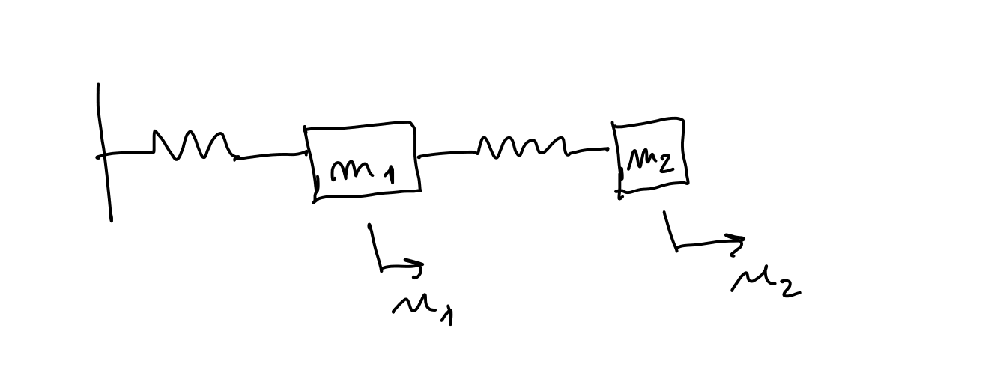
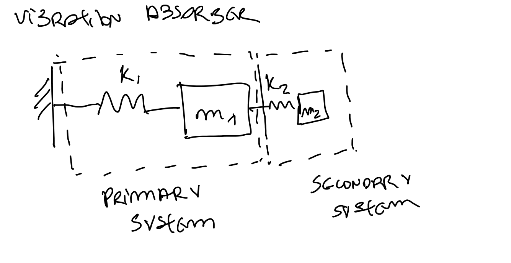

## 8.1 From Free Vibration to Forced Vibration

In Class 7, we studied the **free** 2DOF system. Now we add the harmonic force. A 2DOF system has two independent coordinates, so it will have **two natural frequencies** and **two vibration modes**.

In a 1DOF system we saw:

$$m\ddot{u} + ku = 0 \quad \Rightarrow \quad m\ddot{u} + ku = F_0\sin(\omega t)$$

The same idea applies to our 2DOF system:

$$\mathbf{M}\ddot{\mathbf{u}} + \mathbf{K}\mathbf{u} = \mathbf{0} \quad \Rightarrow \quad \boxed{\mathbf{M}\ddot{\mathbf{u}} + \mathbf{K}\mathbf{u} = \mathbf{F}_0\sin(\omega t)}$$

where $\mathbf{F}_0 = [F_{01},\, F_{02}]^T$ is the excitation force vector. This means the force can be applied to mass 1, mass 2, or both masses.

---

## 8.2 The System for This Class

We use the same 2DOF system as in Class 7, but now apply a harmonic force to **mass 1** only:

{fig-align="center" width="75%"}

The equations of motion are:

$$m_1\ddot{u}_1 + (k_1+k_2)u_1 - k_2 u_2 = F_0\sin(\omega t)$$
$$m_2\ddot{u}_2 - k_2 u_1 + k_2 u_2 = 0$$

In matrix form:

$$\begin{bmatrix} m_1 & 0 \\ 0 & m_2 \end{bmatrix}\begin{bmatrix} \ddot{u}_1 \\ \ddot{u}_2 \end{bmatrix} + \begin{bmatrix} k_1+k_2 & -k_2 \\ -k_2 & k_2 \end{bmatrix}\begin{bmatrix} u_1 \\ u_2 \end{bmatrix} = \begin{bmatrix} F_0 \\ 0 \end{bmatrix}\sin(\omega t)$$

---

## 8.3 Harmonic Steady-State Response

For a linear system excited harmonically, the steady-state response occurs at the **same frequency** as the excitation. We assume:

$$u_1(t) = U_1\sin(\omega t), \qquad u_2(t) = U_2\sin(\omega t)$$

or in matrix form:

$$\boxed{\mathbf{u}(t) = \mathbf{U}\sin(\omega t)}, \qquad \mathbf{U} = \begin{bmatrix} U_1 \\ U_2 \end{bmatrix}$$

The acceleration is $\ddot{\mathbf{u}} = -\omega^2\mathbf{U}\sin(\omega t)$. Substituting into the equation of motion and cancelling $\sin(\omega t)$:

$$\boxed{(\mathbf{K} - \omega^2\mathbf{M})\mathbf{U} = \mathbf{F}_0}$$

---

## 8.4 The Dynamic Stiffness Matrix

Define the **dynamic stiffness matrix**:

$$\boxed{\mathbf{D}(\omega) = \mathbf{K} - \omega^2\mathbf{M}}$$

Then:

$$\mathbf{D}(\omega)\,\mathbf{U} = \mathbf{F}_0 \quad \Rightarrow \quad \boxed{\mathbf{U} = \mathbf{D}^{-1}(\omega)\,\mathbf{F}_0}$$

provided $\mathbf{D}(\omega)$ is invertible. For our system:

$$\mathbf{D}(\omega) = \begin{bmatrix} k_1+k_2-m_1\omega^2 & -k_2 \\ -k_2 & k_2-m_2\omega^2 \end{bmatrix}$$

The two algebraic equations for the response amplitudes are:

$$(k_1+k_2-m_1\omega^2)U_1 - k_2 U_2 = F_0 \tag{1}$$
$$-k_2 U_1 + (k_2-m_2\omega^2)U_2 = 0 \tag{2}$$

---

## 8.5 Solving for the Response Amplitudes

From equation (2):

$$(k_2 - m_2\omega^2)U_2 = k_2 U_1 \quad \Rightarrow \quad U_2 = \frac{k_2}{k_2-m_2\omega^2}\,U_1$$

Substituting into equation (1) and solving for $U_1$:

$$\left[(k_1+k_2-m_1\omega^2) - \frac{k_2^2}{k_2-m_2\omega^2}\right]U_1 = F_0$$

$$\frac{(k_1+k_2-m_1\omega^2)(k_2-m_2\omega^2) - k_2^2}{k_2-m_2\omega^2}\,U_1 = F_0$$

Therefore:

::: {.callout-important}
## Most Important Equation of This Class

$$\boxed{\frac{U_1}{F_0} = \frac{k_2 - m_2\omega^2}{(k_1+k_2-m_1\omega^2)(k_2-m_2\omega^2) - k_2^2}}$$

The numerator and denominator independently control the two key phenomena: **resonance** and **anti-resonance**.
:::

---

## 8.6 Resonance and Anti-Resonance

### Resonance

Resonance occurs when the **denominator** equals zero:

$$(k_1+k_2-m_1\omega^2)(k_2-m_2\omega^2) - k_2^2 = 0$$

This is exactly the determinant condition from Class 7 — $\det(\mathbf{D}(\omega)) = 0$ — so resonance occurs at the two natural frequencies $\omega_1$ and $\omega_2$.

### Anti-Resonance

Anti-resonance occurs when the **numerator** equals zero:

$$k_2 - m_2\omega^2 = 0 \quad \Rightarrow \quad \boxed{\omega = \sqrt{\frac{k_2}{m_2}}}$$

At this frequency, $U_1 = 0$: **the force is applied to mass 1, but mass 1 does not move.** The second mass vibrates and absorbs all the energy — this is the principle of the dynamic vibration absorber.

---

## 8.7 The Dynamic Vibration Absorber

The system can be interpreted as a **primary system** plus an **absorber**:

{fig-align="center" width="75%"}

The absorber has its own natural frequency:

$$\omega_a = \sqrt{\frac{k_2}{m_2}}$$

The anti-resonance condition is $\omega = \omega_a$. To suppress vibration of $m_1$ at the excitation frequency, we tune the absorber so that its natural frequency matches the forcing frequency:

$$\sqrt{\frac{k_1}{m_1}} = \sqrt{\frac{k_2}{m_2}} \quad \Longrightarrow \quad \boxed{k_2 = m_2\,\omega^2}$$

The parameters $k_2$ and $m_2$ must be selected to satisfy this tuning condition.

---

## 8.8 Physical Interpretation at Anti-Resonance

At anti-resonance ($U_1 = 0$), the first equation of motion becomes:

$$(k_1+k_2-m_1\omega^2)\cdot 0 - k_2 U_2 = F_0 \quad \Rightarrow \quad \boxed{U_2 = -\frac{F_0}{k_2}}$$

The absorber mass moves with amplitude $F_0/k_2$ in the **opposite direction** to the applied force. The spring force $-k_2 U_2 = F_0$ exactly cancels the applied force on mass 1 — that is why $m_1$ does not move.

This also shows a practical constraint: the absorber must have enough **stroke** to accommodate this displacement.

---

## 8.9 Dimensionless Form

It is useful to express the response in dimensionless parameters.

Define the primary natural frequency: $\omega_1^{(0)} = \sqrt{k_1/m_1}$

Define the frequency ratio: $r = \omega/\omega_1^{(0)}$

Define the tuning ratio: $f = \omega_a/\omega_1^{(0)}$, where $\omega_a = \sqrt{k_2/m_2}$

Define the mass ratio: $\mu = m_2/m_1$

Define the static displacement: $u_{st} = F_0/k_1$

The dimensionless primary response becomes:

$$\boxed{\frac{U_1}{u_{st}} = \frac{f^2-r^2}{(1+\mu f^2-r^2)(f^2-r^2) - \mu f^4}}$$

When $r = f$ (tuning condition), the numerator is zero and $U_1 = 0$ — this is anti-resonance.

---

## 🎛️ Interactive: Dynamic Vibration Absorber Explorer

Explore the frequency response of the primary mass with and without the absorber. Use the sliders to change the mass ratio $\mu$ and tuning ratio $f$.

```{ojs}
//| panel: input
viewof mu8 = Inputs.range([0.01, 0.30], {value: 0.10, step: 0.01, label: "Mass ratio  μ = m₂/m₁"})
viewof f8  = Inputs.range([0.50, 1.50], {value: 1.00, step: 0.01, label: "Tuning ratio  f = ωₐ/ω₁⁽⁰⁾"})
```

```{ojs}
// Frequency response curves
r8_pts = Array.from({length: 2000}, (_, i) => {
  let r = 0.05 + i * (2.45 / 1999)

  // SDOF reference (no absorber)
  let H_sdof_raw = 1 / (1 - r**2)
  let H_sdof = Math.abs(H_sdof_raw) > 20 ? NaN : Math.abs(H_sdof_raw)

  // 2DOF with absorber
  let num = f8**2 - r**2
  let den = (1 + mu8*f8**2 - r**2)*(f8**2 - r**2) - mu8*f8**4
  let H_dva = Math.abs(den) < 1e-6 ? NaN : Math.abs(num / den)
  if (H_dva > 20) H_dva = NaN

  return {r, H_sdof, H_dva}
})

anti_r = f8   // anti-resonance at r = f
```

```{ojs}
html`
<div style="display:flex;gap:2rem;flex-wrap:wrap;margin:0.4rem 0 1rem 0;font-size:0.93em;color:#333;background:#f8f9fa;padding:0.6rem 1.1rem;border-radius:6px">
  <span>Anti-resonance at <strong>r = f = ${f8.toFixed(2)}</strong> → U₁ = 0</span>
  <span>Absorber displacement: <strong>U₂ = −F₀/k₂</strong></span>
  <span>Mass ratio: <strong>μ = ${mu8.toFixed(2)}</strong>  (m₂ = ${(mu8*100).toFixed(0)}% of m₁)</span>
</div>`
```

```{ojs}
Plot.plot({
  title: "Primary Mass Response  |U₁/u_st|  vs  Frequency Ratio  r",
  marks: [
    Plot.ruleY([0], {stroke: "#ddd"}),
    Plot.ruleY([1], {stroke: "#ccc", strokeDasharray: "3,3"}),
    // Anti-resonance line
    Plot.ruleX([anti_r], {stroke: "#e67e22", strokeDasharray: "6,4", strokeWidth: 1.8}),
    Plot.text([{r: anti_r, H: 18}], {
      x: "r", y: "H",
      text: d => `f = ${f8.toFixed(2)}`,
      fontSize: 11, fill: "#e67e22", dx: 4
    }),
    // SDOF reference
    Plot.line(r8_pts, {
      x: "r", y: "H_sdof",
      stroke: "#aaa", strokeWidth: 1.8, strokeDasharray: "5,3"
    }),
    // DVA response
    Plot.line(r8_pts, {
      x: "r", y: "H_dva",
      stroke: "#1a6faf", strokeWidth: 2.5
    })
  ],
  x: {label: "Frequency ratio  r = ω/ω₁⁽⁰⁾", grid: true, domain: [0, 2.5]},
  y: {label: "|U₁/u_st|", domain: [0, 20], grid: true},
  width: 680, height: 340,
  style: {fontSize: "13px"}
})
```

```{ojs}
html`<div style="font-size:0.85em;color:#666;margin-top:0.3rem">
  <span style="color:#aaa">— — —</span> Without absorber (SDOF) &nbsp;·&nbsp;
  <span style="color:#1a6faf">——</span> With absorber (2DOF) &nbsp;·&nbsp;
  <span style="color:#e67e22">|</span> Anti-resonance at r = f
</div>`
```

> **Try this:** With $\mu = 0.10$ and $f = 1.00$, the absorber eliminates the original resonance at $r = 1$ but creates two new resonance peaks on either side. Increase $\mu$ (heavier absorber) — the two peaks move apart and the "safe zone" around anti-resonance widens. Move $f$ away from 1.0 — the anti-resonance shifts, but the original resonance is no longer suppressed.

---

## 8.10 Design Trade-Off: Absorber Mass

The mass ratio $\mu = m_2/m_1$ controls the trade-off:

- A **larger** absorber mass spreads the two resonance peaks further apart, making the anti-resonance zone wider and more robust.
- A **heavier** absorber adds weight — often undesirable in practice.

The absorber suppresses vibration exactly at one frequency ($r = f$) but introduces **two new resonances** nearby. Real absorbers often include damping to reduce these peaks at the cost of a non-zero response at the tuning frequency.

| Without damping | With damping |
|-----------------|--------------|
| $U_1 = 0$ exactly at $\omega = \omega_a$ | $U_1 \neq 0$ at $\omega = \omega_a$ |
| Two sharp resonance peaks | Two reduced resonance peaks |
| Sensitive to detuning | More robust to frequency variation |

---

## 8.11 Numerical Design Example

**Given:** Machine modeled as a primary SDOF system with $m_1 = 10\,\text{kg}$, $k_1 = 1000\,\text{N/m}$, excited at its natural frequency.

**Step 1 — Primary natural frequency:**

$$\omega_1^{(0)} = \sqrt{\frac{k_1}{m_1}} = \sqrt{\frac{1000}{10}} = 10\,\text{rad/s}$$

**Step 2 — Choose mass ratio** $\mu = 0.1$:

$$m_2 = \mu m_1 = 0.1 \times 10 = 1\,\text{kg}$$

**Step 3 — Tune absorber to** $\omega_a = \omega_1^{(0)} = 10\,\text{rad/s}$:

$$k_2 = m_2\,\omega_a^2 = 1 \times 10^2 = \boxed{100\,\text{N/m}}$$

**Result:** $m_2 = 1\,\text{kg}$, $k_2 = 100\,\text{N/m}$ — the absorber suppresses vibration of $m_1$ at $\omega = 10\,\text{rad/s}$.

**Absorber displacement** at the tuning frequency (for $F_0 = 10\,\text{N}$):

$$U_2 = -\frac{F_0}{k_2} = -\frac{10}{100} = -0.1\,\text{m}$$

The absorber must be designed to accommodate $\pm 100\,\text{mm}$ of stroke.

---

## 8.12 Key Messages

1. Forced 2DOF equation: $\mathbf{M}\ddot{\mathbf{u}} + \mathbf{K}\mathbf{u} = \mathbf{F}_0\sin(\omega t)$
2. Harmonic assumption gives: $(\mathbf{K} - \omega^2\mathbf{M})\mathbf{U} = \mathbf{F}_0$
3. Dynamic stiffness matrix: $\mathbf{D}(\omega) = \mathbf{K} - \omega^2\mathbf{M}$
4. **Resonance** when $\det(\mathbf{D}(\omega)) = 0$ — at the natural frequencies $\omega_1$, $\omega_2$.
5. **Anti-resonance** when numerator = 0: $k_2 - m_2\omega^2 = 0 \Rightarrow \omega = \sqrt{k_2/m_2}$
6. Primary response: $U_1/F_0 = (k_2-m_2\omega^2)\,/\,\det(\mathbf{D})$
7. Tuning condition: $k_2 = m_2\omega^2$ — tune absorber to forcing frequency.
8. At the tuning frequency: $U_1 = 0$ and $U_2 = -F_0/k_2$.
9. The absorber creates a zero-response notch but introduces two new resonance peaks.
10. Practical absorbers include damping to reduce peak severity at the cost of perfect cancellation.

---

## 8.13 What Comes Next

In this class, we used a 2DOF system as a dynamic vibration absorber. We found that, without damping, the absorber gives perfect vibration cancellation at one frequency but creates two new resonances.

The natural next step is to include **damping** in 2DOF systems:

$$\mathbf{M}\ddot{\mathbf{u}} + \mathbf{C}\dot{\mathbf{u}} + \mathbf{K}\mathbf{u} = \mathbf{F}_0\sin(\omega t)$$

This will allow us to study more realistic absorbers and understand the optimal damping ratio that minimises the response over the widest frequency range.
